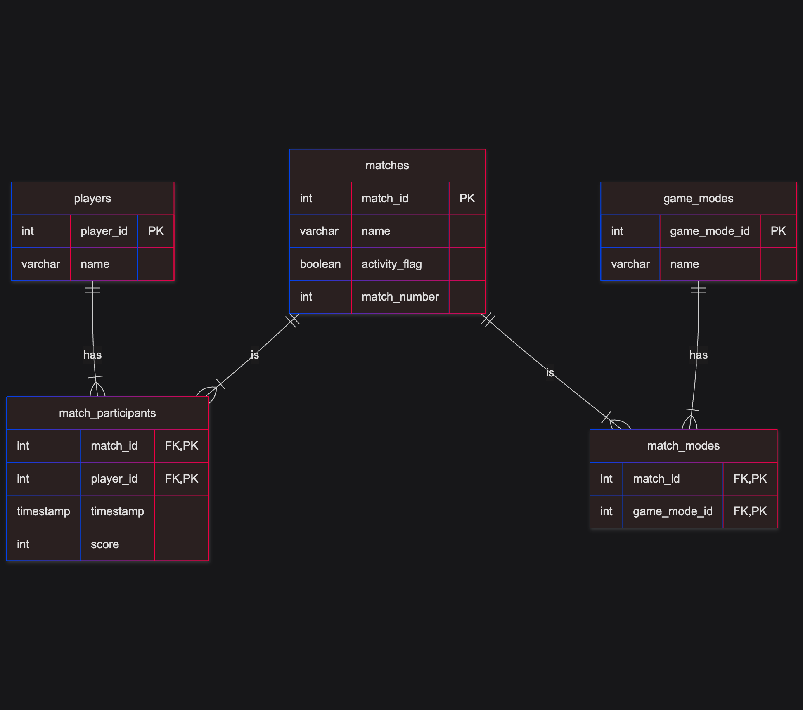

# EX603 Game Telemetry Database

by Jeff Gross

This repository contains the schema and queries for working with a PostgreSQL database that tracks players, matches, and other metrics during play of a online game.

## The Domain

This project defines and implements a model for an online multi-player gaming platform. The various entities include: players which have names, matches, which have names, an activity flag (true when match is in progress, false when match completes), and a match number (whose use is TBD), and game modes, a lookup list of the different modes the gameplay may take.

The relationship between these entities include a many-to-many relationship between matches and players where multiple players can be in a match and players can play multiple matches, and a many-to-many relationship between matches and game modes where matches can have multiple game modes.

The basic questions that must be answerable by the model include:
1. How many players are in the system?
2. How many matches are in the system?
3. How many players are in each match and who are they?
4. When did a player join a match and what is their current or final score?
5. What game modes is a match using?

More advance questions include:
1. How many matches have been completed (activity flag is false)?
2. How many matches has each player played?
3. What is the average score of a player?
4. What are the top scores (leaderboard) within a match?
5. What are the top scores (leaderboard) across all matches?

## Schema

_Summarize the five roles and your key design decisions._

### Entity Relationship Diagram

## Query Catalogue

_Per unit, a short table listing the queries and the business question each answers, linked to the .sql files._

## Technical Highlights

_Three to five things a reader should notice._

## What I would do Differently

_An honest paragraph. Critiquing your own work is a senior signal, not a weakness._

## Video Presentation

_Embed or link the video._

## How to Run it

_The commands to create the schema and execute a query. Assume the reader has a database and nothing else._

## History

| Week |   Date    | Changes                                  |
| ---- | --------- | ---------------------------------------- |
| 1    | 2026SEP09 | Project setup and initial README.        |
|      | 2026SEP11 | Basic model doc with minimal attributes. |
|      |           | Unit 1 analysis.                         |
